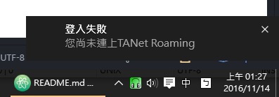

# TANet Roamer 校園網路漫遊器

[](https://travis-ci.org/ALiangLiang/TANetRoamer-desktop "Travis CI") [](https://ci.appveyor.com/project/ALiangLiang/tanetroamer-desktop "AppVeyor") [](https://github.com/ALiangLiang/TANetRoamer-desktop/releases/latest "最新版本")[](https://github.com/ALiangLiang/TANetRoamer-desktop/releases/latest "下載次數")[](https://github.com/ALiangLiang/TANetRoamer-desktop/blob/master/LICENSE "MIT開源協議")

以最方便的操作流程，取得全台灣的 TANetRoaming WIFI 的漫遊認證。

 

目前需要各校同學的協助，讓大家都可以省下輸入帳號密碼的時間。協助請參考[開發](#開發 "開發")。

## 使用說明

#### 下載與安裝

至[下載頁面](https://github.com/ALiangLiang/TANetRoamer-desktop/releases/latest "下載頁面")下載安裝檔。

Windows 的用戶請下載 TANet.Roamer.Setup.x.x.x.exe。

Linux 的用戶請下載 tanetroamer-desktop-x.x.x-x86_64.[tar.xz/tar.gz/tar.bz2/AppImage]。

#### 設定

安裝完後，第一次開啟程式，選擇所在的校園，並輸入帳號密碼後儲存。

#### 自動登入

只要設定完成，每次開啟程式將會自動登入。

#### 變更設定

若要修改設定，點擊登入後的通知就可以開啟設定視窗。

#### 更新程式

每次開啟程式都會自動檢查更新並更新，若要手動更新請至[下載頁面](https://github.com/ALiangLiang/TANetRoamer-desktop/releases/latest "下載頁面")重新下載安裝檔。

## 特色

- 一鍵登入校園 WI-FI ，方便快速。
- 自動更新。

## 支援學校 與 貢獻者

- 國立彰化師範大學 - ALiangLiang
- 國立中興大學 - ALiangLiang
- 國立中央大學 - ALiangLiang
- 國立中正大學 - BePsvPT (2016/11/13)
- (其他校園待測試)

## 開發

### app/schools.json

這個檔案是各校的設定檔，id 與 name 都已經準備好，就只差 url 與 data，url 為各校 WIFI 登入的 API 網址，data 則是傳送給 API 的資料，其中值為 %u 與 %p 的皆會被使用者設定的帳號與密碼取代。

 若有學校的登入流程複雜或特殊，請[開 issue](issue/new) 討論是否更改程式結構。

```javascript
[{
  "id" : "0015", // 學校代碼，依照 https://ulist.moe.gov.tw/ 公布資訊為主
  "name" : "國立彰化師範大學", // 學校名稱
  "url" : "http://securelogin.arubanetworks.com/auth/index.html/u", // 登入 API 網址
  "data" : { // 送 API 的資料，視學校 API 而有所不同，此為彰師大設定。
    "user" : "%u", // 值為 '%u'，指的是帳號
    "password" : "%p", // 值為 '%p'，指的是密碼
    "cmd" : "authenticate",
    "Login" : "繼續"
  }
}]
```

### TODO

- [ ] 偵測 SSID 變更，全自動登入。
- [ ] 產品 icon。
- [x] 自動更新。
- [ ] 安全記憶帳號密碼。
- [ ] mac 版本支援。
- [ ] 增加測試 scripts。
- [ ] 憑證驗證，防止偽造 WIFI 熱點。
